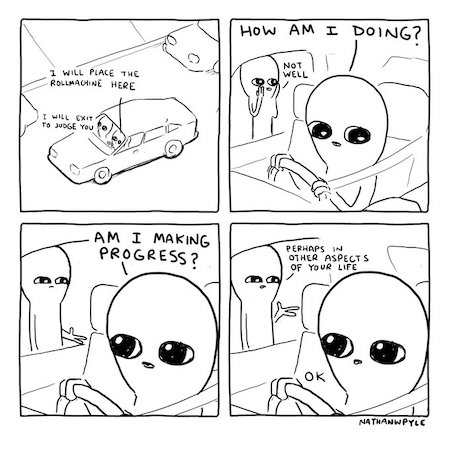
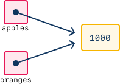
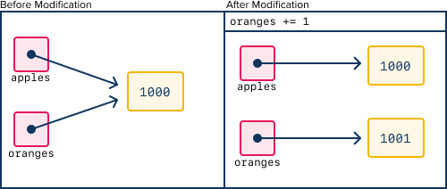
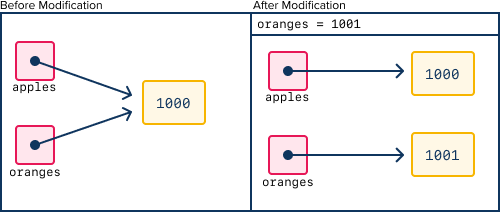
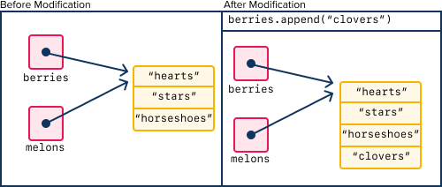
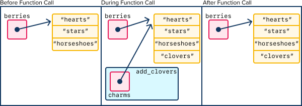
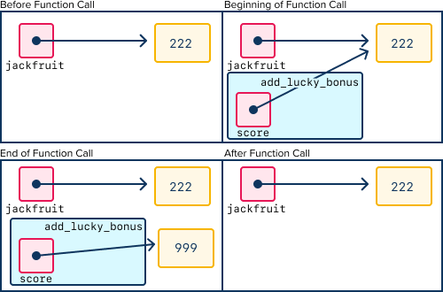

# Variables Are References

<iframe src="https://adaacademy.hosted.panopto.com/Panopto/Pages/Embed.aspx?pid=cc8cb0a2-187a-49f2-9257-ace700539dcf&autoplay=false&offerviewer=true&showtitle=true&showbrand=false&start=0&interactivity=all" height="405" width="720" style="border: 1px solid #464646;" allowfullscreen allow="autoplay"></iframe>

## Our Goal

Our goal in this lesson is to understand what it means to say "variables are references."

Creating a mental model of how references work will:

- increase our programming skills
- increase our debugging skills
- give us better understanding about computers
- give us more precise ways to talk about programming
- <del>help us make null pointer exception jokes</del>

The best way we can use our energy in this lesson is to read it, take notes on it, and constantly experiment with code using a Python REPL. Much of this material is learned through typing out code and seeing the output inside a Python REPL. Feel free to use the Python REPL or to make a `.py` file. Copy and paste the code as you go, and modify examples to help understanding.

## Vocabulary and Synonyms

| Vocab           | Definition                                                                                                                                                                                                               | Synonyms                   | How to Use in a Sentence                                                                                                                                                                           |
| --------------- | ------------------------------------------------------------------------------------------------------------------------------------------------------------------------------------------------------------------------ | -------------------------- | -------------------------------------------------------------------------------------------------------------------------------------------------------------------------------------------------- |
| Object Identity | An object's unique identity that never changes once it's been created. Usually a number. Similar to an object's address in memory. Find this with `id(obj)`. In a comparison that uses `is`, Python compares object IDs. | Object's address in memory | "I knew those two objects were different because they have different object IDs," "Maybe that variable's value is changing because two variables point to the same object with the same object ID" |

## Objects: Values, Types, and IDs

Objects are a unit of data in programming that consist of three parts:

1. Value
2. Data type
3. Identity

"Object" is a fancy name for data "things" we've been working with so far.`"Hello, World!"` is an _object_, which has a value `"Hello, World!"` and a data type of `str`.

More examples:

- `33` is an object with a value `33` and a data type of `int`
- `True` is an object with a value `True` and a data type of `bool`
- `[81, 231, 12]` is an object with a data type of `list`. It contains three objects.

An object's **identity** is an ID that a machine gives it when it's created. A machine will use an object's ID to find the correct object.

While a program is running, every time an object is created, the object gets put into computer memory and is given an identity. We can think of this ID as the object's address in memory.

We can see an object's ID by using the `id()` function.

```python
print('The ID of the string object "Hello, World!" is', id("Hello, World!"))
```

The `is` operator compares object IDs. **_An object's identity never changes within its lifetime_**.

## Variables Are References

Variables are references that point to objects in memory. By calling them references, we mean that variables _don't_ store the _value_ of an object. Instead, we can think of variables as holding a copy of the _object ID_.

Consider this code:

```python
hello_world = "Hello, World!"
current = 33
is_enabled = True
winners = [81, 231, 12]
```

- `hello_world` is a variable that refers to the object `"Hello, World!"` in memory
- `current` is a variable that refers to the object `33` in memory
- `is_enabled` is a variable that refers to the object `True` in memory
- `winners` is a variable that refers to the object `[81, 231, 12]` in memory


## An Analogy: Variables and Valet Parking

  
[(source)](https://twitter.com/nathanwpyle/status/1289704708869771264)

Variables and their values can be described like valet parking services.

Stevie drives their blue car and needs to park at a hotel. They are gifted _free_ valet service (so fancy). The attendant takes the car and parks it in the parking spot numbered 151. The attendant gives a ticket to Stevie and says, "when you want your car back, turn in this special ticket, and your car will come out."

When Stevie wants their car back, they need to show their special ticket.

Variables are like the special ticket. The **ticket pointed to where the car was**.

**The actual car is the actual value**. The actual car took up space in parking spot #151.

There could be multiple tickets for whatever car, bike, or vehicle is in parking spot #151. Stevie can bring their friend and ask the valet to issue them a ticket for the vehicle in spot #151. Maybe all Stevie's friends have gotten a ticket. And then all of _their_ friends! Stevie really needs to get some better friends!

Variables work very similarly. Whenever a new value is stored in memory in a running program, that value occupies some location in memory (a numbered spot) represented by its object ID. When we assign a value to a variable, it's like issuing a ticket (the named variable) with the data location noted on the ticket. **Variables point to different spaces in memory, not the value at that location itself**. When we read a variable, the computer grabs the value from that spot in memory for us to use.

In this world, if we know someone who has a ticket to a different spot (say #152), we can go with them to the valet and have our ticket updated to refer to spot #152. If we use this ticket now, anything we do will be to the vehicle in #152, but whatever was in #151 will be safe and sound for Stevie and their friends to keep using.

Changing the parking spot that the tickets point to is **reassignment**.

### More Analogies

These are several imperfect analogies that can illustrate how variables refer to values.

- Variables are cups with a label on them. We give each cup a name, such as `stevies_drink` or `number`. The cup can hold different things and we can replace the value it holds.

- Variables are like home addresses, such as 123 Main St. The value would be the literal residence located at 123 Main St., walls and doors and all.

- "_The Little Prince_" was not written by Antoine de Saint-Exupéry, but _The Little Prince_ was written by a man named Antoine de Saint-Exupéry.

## Immutable vs. Mutable Data Types

The data types we most commonly work with in Python are `int`, `str`, `float`, `list`, `dict`, and `bool`.

These data types can be classified as either **immutable** or **mutable** data types.

_Mutability_ means an object's ability to change. An object of an _immutable_ data type _cannot be changed_. An object of a _mutable_ data type can be changed, modified, altered, in other words "mutated."

Some of Python's immutable data types are:

- `int`
- `float`
- `decimal`
- `string`

Some of the mutable data types are:

- `list`
- `dict`

Examples of mutation and modification include:

- Appending or removing an item to a list
- Adding or removing a key-value pair to a dictionary

Examples of operations that do _not_ mutate or modify include:

- Adding two numbers, resulting in a third number, such as `sum = 1 + 2`
- Incrementing a number stored in a variable, like `num += 1`

### !callout-info

## Adding Integers Doesn't Modify

When considering `sum = 1 + 2`, it may seem like we are modifying either the 1 or the 2 to turn it into a 3, which gets assigned to the variable `sum`. In reality, summing 1 and 2 changes neither 1 nor 2. Both retain their 1-ness and 2-ness, but they give us a new value, 3! Then `sum` gets a reference to 3, not the value 3 itself.

<br>

In the case of `sum += 1`, by default, this line is evaluated as `sum = sum + 1`. Therefore, it works like the situation above! 1 retains its 1-ness and `sum` gets re-assigned to the new integer value.

### !end-callout

What does this _mean_ and how does it impact programming? One of the best ways to witness the differences is to learn how a computer manages them in memory, discussed below.

## Numbers, Bools, and Strings Are Immutable

Immutable objects don't change! Even when we do something that looks like it changes an immutable object, like the examples above, we are really getting an entirely different object.

### Using `id()` to Investigate Immutabilty

We saw that Python provides a function `id()` that tells us the object ID for any value in our program. We can use it to see whether performing an operation on a value modifies that value itself, or whether it produces a different object entirely. For example:

```python
apples = 1000
oranges = apples

print("id of apples:", id(apples))
print("id of oranges:", id(oranges))
```

Running the above code gives us output like this:

```
id of apples: 4317740336
id of oranges: 4317740336
```



From this output, we see that `apples` and `oranges`, share a reference to the **same** object ID. We started by storing a reference to `1000` in `apples`, then assigning that reference to `oranges`. As a result, `apples` and `oranges` both refer to the same object ID.

### Modifying an Immutable Object Produces a Different Object

Continuing our investigation, let's consider what happens when we try to modify `oranges`.

```python
apples = 1000
oranges = apples

print("[Before modification]", "id of apples:", id(apples))
print("[Before modification]", "id of oranges:", id(oranges))

oranges += 1

print("[After modification]", "id of apples:", id(apples))
print("[After modification]", "id of oranges:", id(oranges))
```

Now the code produces something like this:

```
[Before modification] id of apples: 4500497616
[Before modification] id of oranges: 4500497616
[After modification] id of apples: 4500497616
[After modification] id of oranges: 4499961936
```



As with the previous example, before the increment we see that `apples` and `oranges` both share a reference to the same object ID once more. But _after_ the increment, `apples` refers to the same object ID, while `oranges` refers to a different object ID. We can see that even though incrementing a number may seem like it's modifying the number, it actually gives us a reference to a different number entirely!

This is true for any operation that appears to modify an immutable object. We get a reference to a different object.

### Reassignment Replaces the Object

If we reassign an object reference to a variable, the variable is updated to refer to the new object, and the original object is left unchanged.

```python
apples = 1000
oranges = apples

print("[Before modification]", "id of apples:", id(apples))
print("[Before modification]", "id of oranges:", id(oranges))

oranges = 1001

print("[After modification]", "id of apples:", id(apples))
print("[After modification]", "id of oranges:", id(oranges))
```

This code is similar to the previous example, and it has similar output:

```
[Before modification] id of apples: 4453532880
[Before modification] id of oranges: 4453532880
[After modification] id of apples: 4453532880
[After modification] id of oranges: 4453533040
```



Again, before the reassignment, `apples` and `oranges` both refer to the same object ID. After the reassignment, `oranges` refers to a different object ID. So the variable is refering to a completely different object than it started with.

## Lists and Dictionaries Are Mutable

Mutable objects, on the other hand, do _not_ change object IDs when the object is modified or _mutated_. Mutable objects _keep_ their current object IDs, even after being mutated.

Examples of mutation and modification include:

- Appending an item to a list
- Removing an item from a list
- Changing the value of an item in a list
- Adding a key-value pair to a dictionary
- Removing a key-value pair from a dictionary
- Changing the value of a key or value in a dictionary

Mutation and modification **_does not_** include reassignment. As with immutable objects, reassigning a different mutable object to a variable replaces the existing reference. The original object is unchanged, and the modified variable now refers to the new object.

### Modifying a Mutable Object Doesn't Affect Its ID

We can modify a mutable object, and the mutable object will continue to have the same object ID.

```python
mangoes = ["hearts", "stars", "horseshoes"]

print("[Before modification]", "id of mangoes:", id(mangoes))

mangoes.append("clovers")

print("[After modification]", "id of mangoes:", id(mangoes))
print("[After modification]", "value of mangoes", mangoes)
```

When we run the above code, we may see output like this:

```
[Before modification] id of mangoes: 4368230016
[After modification] id of mangoes: 4368230016
[After modification] value of mangoes ['hearts', 'stars', 'horseshoes', 'clovers']
```


_Even after modification_, the mutable object's object ID remains the same.

## Multiple References to Mutable Objects

As mentioned earlier, variables are references to objects in memory.

As with immutable objects, we can end up with two different variables referring to _the same_ object in memory. But with mutable objects, the situation is a little more interesting.

Imagine a variable `berries` that points to a list in memory. Then imagine a variable `melons` that is assigned to `berries`.

```python
berries = ["hearts", "stars", "horseshoes"]

melons = berries
```

We can describe the relationship between `melons` and `berries` in any of these following ways:

- The value of `melons` is whatever the value of `berries` is
- The variable `melons` refers to the object to which `berries` refers
- `melons` and `berries` both refer to the same object

Let's prove this with object IDs:

```python
berries = ["hearts", "stars", "horseshoes"]
melons = berries

print("id of berries:", id(berries))
print("id of melons:", id(melons))
```

When we run the above code, we may see output like this:

```
id of berries: 4506303040
id of melons: 4506303040
```


`berries` and `melons` **have the same object ID because they refer to the same object**.

Let's repeat our experiment with a few more variables and confirm:

1. Multiple variables can refer to the same object
1. Reassignment changes what the variable points to

```python
berries = ["hearts", "stars", "horseshoes"]
melons = berries
loquats = melons
print("id of berries:", id(berries))
print("id of melons:", id(melons))
print("id of loquats:", id(loquats))

print("Reassigning melons to a new object:")

melons = ["sneezy", "sleepy", "happy"]
print("id of berries:", id(berries))
print("id of melons:", id(melons))
print("id of loquats:", id(loquats))

print("Reassigning melons to berries (again):")

melons = berries
print("id of berries:", id(berries))
print("id of melons:", id(melons))
print("id of loquats:", id(loquats))
```

```
id of berries: 4510649216
id of melons: 4510649216
id of loquats: 4510649216
Reassigning melons to a new object:
id of berries: 4510649216
id of melons: 4510624000
id of loquats: 4510649216
Reassigning melons to berries (again):
id of berries: 4510649216
id of melons: 4510649216
id of loquats: 4510649216
```

### !callout-success

## Pro-Tip: Experiment!

There are a huge number of ways to assign and reassign and check this logic. Experiment in your own Python files!

### !end-callout

## Modifying Mutable Objects

Let's review our major concepts so far:

1. Variables are references to objects in memory
1. Immutable data types don't change. Different immutable objects always occupy different places in memory and have different object IDs.
1. Mutable data types can change. Even if an object is modified, it will still occupy the same place in memory and have the same object ID.
1. Multiple variables can point to the same object

When we combine and synthesize these concepts, we can observe that **multiple references to the same mutable object will all see the same changes**.

```python
berries = ["hearts", "stars", "horseshoes"]
melons = berries

print("Before modifying berries")
print("id of berries:", id(berries))
print("id of melons:", id(melons))
print("value of melons:", melons)

berries.append("clovers")

print("After modifying berries")
print("id of berries:", id(berries))
print("id of melons:", id(melons))
print("value of berries:", berries)
print("value of melons:", melons)
```

When we run the above code, we may see output like this:

```
Before modifying berries
id of berries: 4369938880
id of melons: 4369938880
value of melons: ['hearts', 'stars', 'horseshoes']
After modifying berries
id of berries: 4369938880
id of melons: 4369938880
value of berries: ['hearts', 'stars', 'horseshoes', 'clovers']
value of melons: ['hearts', 'stars', 'horseshoes', 'clovers']
```



Re-read through the code slowly, and take notes about how the modification to `berries` affects the value that `melons` points to.

`berries` and `melons` both point to the same object. We modify the object with object ID `4369938880` with `berries.append("clovers")`. We see that the value of `melons` (which also points to the object `4369938880`) is modified as well.

## Applied in Function Arguments

When we pass values into a function call, we should be aware of whether we are passing a mutable or an immutable object.

As we've learned about parameters in functions, parameters are local variables.

Now, with this lesson's vocabulary, we might say parameters initially _point_ to the same object of whatever argument is passed into a function call.

### Mutable Objects Passed Into Functions

When we pass a mutable object into a function, **that function can modify the object passed in**.

Read through the code below. Take notes about how many variables there are, how many objects in memory there are, when modifications to those objects are made, and what the result is.

```python
def add_clovers(charms):
    print("==== Appending 'clovers' to charms ====")
    print("id of charms:", id(charms))
    charms.append("clovers")

berries = ["hearts", "stars", "horseshoes"]
print("==== Before calling add_clovers ====")
print("id of berries:", id(berries))
print("value of berries:", berries)

add_clovers(berries)

print("==== After calling add_clovers ====")
print("id of berries:", id(berries))
print("value of berries:", berries)
```

When we run the above code, we may see output like this:

```
==== Before calling add_clovers ====
id of berries: 4460399680
value of berries: ['hearts', 'stars', 'horseshoes']
==== Appending 'clovers' to charms ====
id of charms: 4460399680
==== After calling add_clovers ====
id of berries: 4460399680
value of berries: ['hearts', 'stars', 'horseshoes', 'clovers']
```



We should observe:

1. `berries` points to a mutable object
1. When we call `add_clovers`
   - We pass in `berries`
   - `charms` points to the same mutable object that `berries` does
1. The object that `charms` points to is modified with `charms.append()`
1. Because `charms` was modified, so was `berries`

### Immutable Objects Passed Into Functions

When we pass an _immutable_ object into a function, that function cannot modify the object passed in. Any "modifications" are likely reassignment.

Recall that reassignment replaces a variable's reference with a reference to the new object. Since parameters are local variables, only the local reference is replaced. The external variable is left unchanged, as a brief example will show.

Read through the code below.

```python
def add_lucky_bonus(score):
    print("id of score:", id(score))
    print("==== Adding 777 to score ====")
    score += 777
    print("id of score:", id(score))

jackfruit = 222
print("==== Before calling add_lucky_bonus ====")
print("id of jackfruit:", id(jackfruit))
print("value of jackfruit:", jackfruit)

add_lucky_bonus(jackfruit)

print("==== After calling add_lucky_bonus ====")
print("id of jackfruit:", id(jackfruit))
print("value of jackfruit:", jackfruit)
```

When we run the above code, we may see output like this:

```
==== Before calling add_lucky_bonus ====
id of jackfruit: 4539856336
value of jackfruit: 222
id of score: 4539856336
==== Adding 777 to score ====
id of score: 4551559440
==== After calling add_lucky_bonus ====
id of jackfruit: 4539856336
value of jackfruit: 222
```



We should observe:

1. `jackfruit` points to an immutable object
1. When we call `add_lucky_bonus`
   - We pass in `jackfruit`
   - `score` initially points to the same object as `jackfruit`
   - After `score += 777`, `score` points to a different immutable object
1. `jackfruit` continues to point to the same immutable object

## Extending the Concept: Nested Data Structures

Lists and dictionaries are not only mutable data types, but they're also _containers_. As containers, they contain either mutable or immutable data types themselves!

The same principles extend to nested data structures.

Consider the following questions:

- Imagine a list within a list. If we modify the inner list, does that affect the references pointing to it?
- Imagine a dictionary within a list. What are the effects of modifying the inner dictionary?

Make a prediction. Run an experiment.

<!-- Question 1 -->
<!-- prettier-ignore-start -->
### !challenge
* type: paragraph
* id: tRHUpg
* title: Variables Are References
##### !question

Predict:

- Imagine a list within a list. If we modify the inner list, does that affect the references pointing to it?
- Imagine a dictionary within a list. What are the effects of modifying the inner dictionary?

##### !end-question
##### !placeholder

I predict...

##### !end-placeholder
### !end-challenge
<!-- prettier-ignore-end -->

Now, read through this code and its example output:

```python
peaches = ["Hello", [False, False, False] ,"World!"]

pears = peaches[1]

pears.append(True)

print("value of peaches:", peaches)
```

```
value of peaches: ['Hello', [False, False, False, True], 'World!']
```

`peaches[1]` _and_ `pears` both point to the mutable object `[False, False, False]`.

When we modify that object with `pears.append()`, we modify the same object referred to by `peaches[1]`.

Let's look at an example dictionary inside a list:

```python
pears = {
    "hello": "world!"
}

peaches = [False, pears, False]

pears["hello"] = "modified value"

print("value of peaches:", peaches)
```

```
value of peaches: [False, {'hello': 'modified value'}, False]
```

`pears` and `peaches[1]` refer to the same dictionary object.

We modified the dictionary referred to by `pears` by storing a new value for the `"hello"` key. Modifying `pears` also affects the item at `peaches[1]`.

### !callout-info

## Endless Combinations

Curious about more combinations, such as a list in a dictionary, or a list inside a list inside a list? Follow your curiosity and experiment!

### !end-callout

### !callout-success

## Foreshadowing: OOP

When discussing object-oriented programming, we'll write user-defined classes. User-defined classes are mutable data types by default.

### !end-callout

## Prefer Returning Results Over Modifying Inputs

We must remain aware of how references and mutable objects interact within our functions.

Without awareness, modifying a mutable object risks unintentionally affecting other references.

As general patterns to takeaway:

1. Stay aware of the difference between modifying and reassigning
1. While programming, create diagrams to help understand references between variables and objects
1. It's usually more desirable to _return_ important results from a function, rather than modifying a value that was passed in
   1. Callers of our functions usually don't expect the values they pass in to be modified unless there is clear documentation that our function will do so

## Check for Understanding

<!-- Question 2 -->
<!-- prettier-ignore-start -->
### !challenge
* type: paragraph
* id: AZDwBk
* title: Variables Are References
##### !question

Create one (imperfect) analogy that illustrates how variables are references to values. Describe it in 2-4 sentences below.

Use the analogies of Stevie's car and valet service, the cup, the house, or the author as inspiration.

##### !end-question
### !end-challenge
<!-- prettier-ignore-end -->

<!-- Question Takeaway -->
<!-- prettier-ignore-start -->
### !challenge
* type: paragraph
* id: 9Nqz2c
* title: Variables Are References
##### !question

What was your biggest takeaway from this lesson? Feel free to answer in 1-2 sentences, draw a picture and describe it, or write a poem, an analogy, or a story.

##### !end-question
##### !placeholder

My biggest takeaway from this lesson is...

##### !end-placeholder
### !end-challenge
<!-- prettier-ignore-end -->
